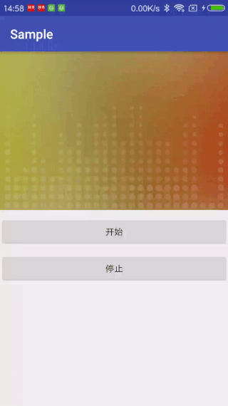

# Rock

[](https://jitpack.io/#ShortStickBoy/Rock)
[](http://www.apache.org/licenses/LICENSE-2.0.html)

Rock is an audio playback beating animation control, you can easily control the various properties of the animation.

### ScreenShot


### Gradle
```groovy
dependencies {
    compile 'com.github.ShortStickBoy:Rock:V2.0.0'
}
```

### Use
```groovy
<com.sunzn.rock.library.RackVew
    android:id="@+id/rv"
    android:layout_width="match_parent"
    android:layout_height="250dp"
    android:background="@drawable/bg"
    app:rv_circle_fill_color="#20FFFFFF"
    app:rv_gap_circle_square="4"
    app:rv_max_circle_radius="10"
    app:rv_per_circle_update="150" />
```

| Attribute            | Describe                                  | Additional                  |
| -------------------- | ----------------------------------------- | --------------------------- |
| rv_min_circle_radius | The radius of the top circle              | Support integer             |
| rv_max_circle_radius | The radius of the bottom circle           | Support integer             |
| rv_gap_circle_square | The gap between the bottom circle         | Support integer             |
| rv_ver_circle_number | The max number of circles in the vertical | Support integer             |
| rv_per_circle_update | Time interval of refresh ui               | Support integer             |
| rv_circle_fill_color | The color of the circle                   | Support color and reference |

### License
```
Copyright [2017-2018] sunzn

Licensed under the Apache License, Version 2.0 (the "License");
you may not use this file except in compliance with the License.
You may obtain a copy of the License at

   http://www.apache.org/licenses/LICENSE-2.0

Unless required by applicable law or agreed to in writing, software
distributed under the License is distributed on an "AS IS" BASIS,
WITHOUT WARRANTIES OR CONDITIONS OF ANY KIND, either express or implied.
See the License for the specific language governing permissions and
limitations under the License.
```